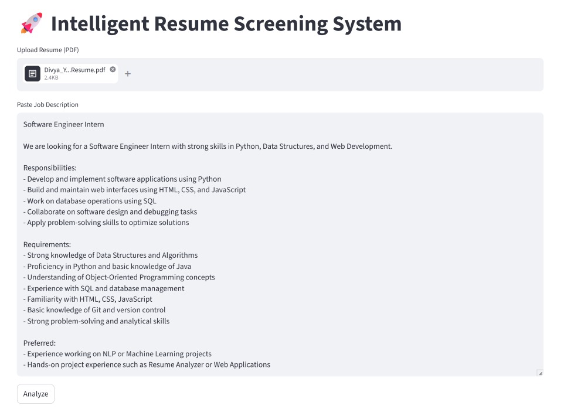
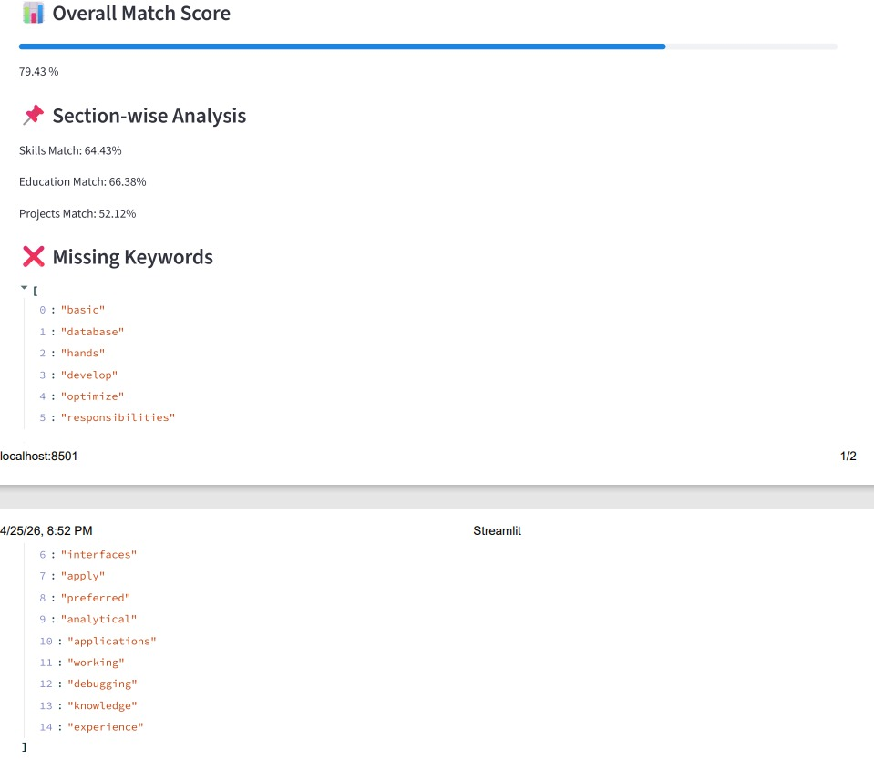

# 🚀 AI Resume Analyzer

An intelligent resume screening system that evaluates how well a resume matches a job description using NLP and semantic similarity.

---

## 📌 Features

- 📄 Resume PDF parsing  
- 🤖 Semantic similarity using transformer models  
- 📊 Match score calculation  
- 📌 Section-wise analysis (Skills, Education, Projects)  
- ❌ Missing keyword detection  
- 🧠 ATS compatibility score  
- 💡 Smart suggestions for improvement  

---

## 🛠️ Tech Stack

- Python  
- Streamlit  
- Sentence Transformers  
- Scikit-learn  
- NLTK  

---

## 📸 Screenshots

### 📝 Input


### 📊 Match Score & Section Analysis


### 🤖 ATS Score & Suggestions


---

## 🎯 Sample Output

This example shows a resume-job match score of ~79%, indicating a strong alignment between candidate skills and job requirements.

---

## ⚙️ How to Run

```bash
pip install -r requirements.txt
streamlit run app.py
